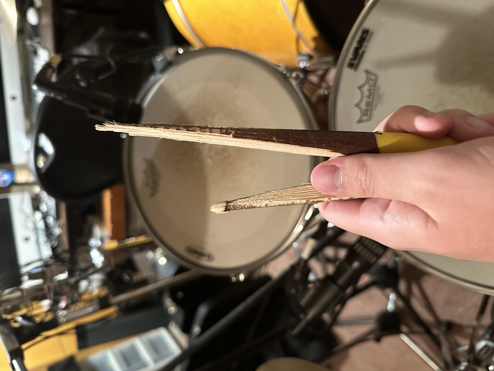
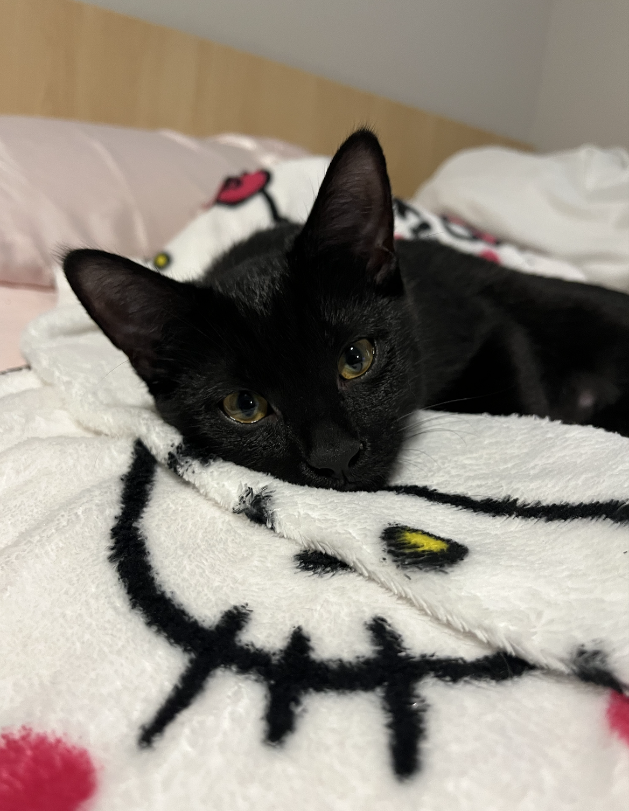

# Ben, Sàmie, & Aayush
***Wait that's a third person***

## Ben Kettlewell
### Hobbies
- Drumming
- Videography
- Video Editing
- Gaming

### Skills
- Organization
- Media
- Tech
- Music

This is an image of the first drumstick I broke 

## Aayush Diyali
### Hobbies
- Travelling 
- Videography
- Video Editing
- Gaming
- Photo editing
- Fishing
### Skills
- Well-organized
- Photography
- Coding
- Music

This is my favourite photo, which was captured during my trek to mardi himal base camp.

## Sàmie Lemire
### Hobbies
- Animation
- Gaming
- Music
- Socializing
- Sports
### Skills
- Singing
- Teamwork
- Design

This is my kitten Katana, that I adopted last week. She's only 6 months old and a wild card.

## Contributing
1. Fork it!
2. Create your feature branch: git checkout -b my-new-feature
3. Commit your changes: git commit -am 'Add some feature'
4. Push to the branch: git push origin my-new-feature
5. Submit a pull request :D

## History
**V1:** Folder Structure

**V2:** Title & First Profile

**V3:** Second Profile

**V4:** Third Profile

**V5:** Image Fixes/Changes

**V6:** Additional Info

## Credits

Ben Kettlewell

Aayush Diyali

Sàmie Lemire

## Licence
MIT License
